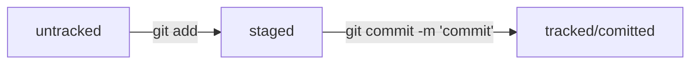

# gittest
  
## описание
  
- базовые команды по git  
- синхронизация с удаленным git

  
## работа с локальным git  
### создание, конфигурирование  
git init  
git status  

### добавление изменений с коммит
git add .  
git commit -m "%%"  
git log  

## работа с удаленным git  
### создание репозитория  
[репозиторий GIT](https://github.com/Nikin123/gittest)
### настройка ssh  
ssh-keygen -t ed25519 -C "email"
pub -> вносим в настройки репозитория на GIT
ssh -T git@github.com
### синхронизация локального и удаленного git  
git remote add origin git@github.com:Nikin123/gittest.git  
git remote -v  
git push  
  
## информация по git log  
вывод git log
commit - xеш, основной идентификатор коммита  
Author — имя автора и его электронная почта  
Date — дата и время создания коммита  
git log --oneline - сокращенный вывод коммитов  
  
## HEAD git  
HEAD - служебный файл папки .git, указывает на последний коммит  
refs/heads/master - хранится хэш последнего коммита  
  
## статусы фалов в репозитории  
Статусы untracked/tracked, staged и modified  
  

